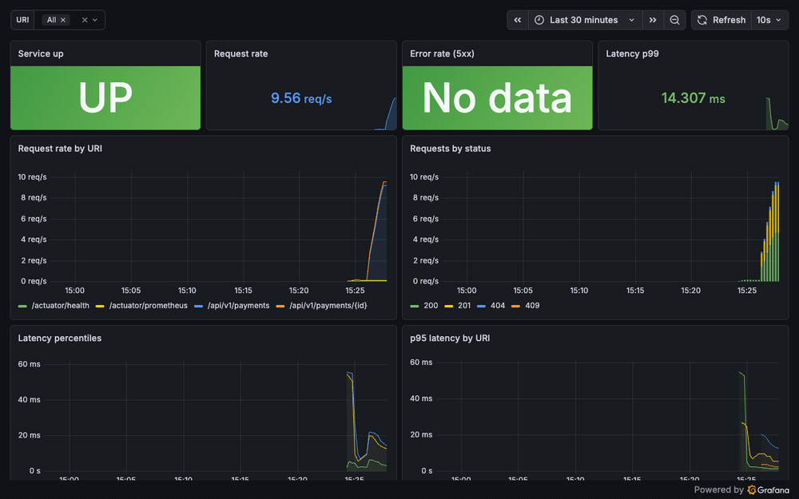
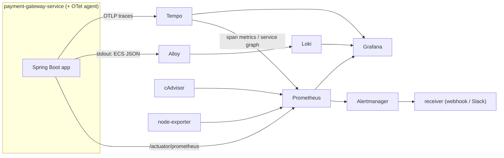

# observability-stack

[](https://github.com/rafaelinfante/observability-stack/actions/workflows/ci.yml)
[](LICENSE)


The production-readiness layer I wrap around a service: the three pillars of
observability — **metrics, logs and traces** — plus a real **CI/CD delivery
pipeline**, all as code, around my [`payment-gateway-service`](https://github.com/rafaelinfante/payment-gateway-service).
One `docker compose up` brings up the service and a full Grafana/Prometheus/Loki/
Tempo/Alloy/Alertmanager stack, with dashboards and alerts that light up in under
a minute.

I built this because a service isn't done when the tests pass — it's done when you
can *see* it running in production and *ship* it safely. This is the public version
of the CI/CD-and-monitoring work I did at Telclic (26 Jenkins pipelines, SonarQube,
Wazuh, Uptime Kuma, deploys cut from ~15 minutes to ~1). I deliberately kept it
**non-invasive**: the service is pulled in as a git submodule and instrumented at
runtime, so there isn't a single source change in it — the value here is the *setup
judgment*, not new application code.

<!--
  A short Grafana walkthrough GIF belongs here. Record it once with the stack
  running (the dashboards populate within a minute of `docker compose up`), drop it
  in docs/, and reference it:
  
-->

---

## The three pillars

| Pillar | How it's collected | Stored in | Seen in |
|--------|--------------------|-----------|---------|
| **Metrics** | Micrometer → `/actuator/prometheus`, scraped by Prometheus (+ cAdvisor, node-exporter) | Prometheus | Grafana |
| **Logs** | Service logs ECS JSON; **Alloy** tails the container off the Docker socket | Loki | Grafana |
| **Traces** | **OpenTelemetry Java agent** attached at runtime → OTLP | Tempo | Grafana |

The agent is the key trick. It's attached through `JAVA_TOOL_OPTIONS` in a thin
image layer on top of the service, so it auto-instruments HTTP, JDBC and Tomcat
**without touching the service's code**, and injects `trace_id` / `span_id` into the
MDC. Because the service already logs structured JSON, those ids ride along in every
log line — which is what makes logs, traces and metrics line up in Grafana.

## Architecture



## Run it

One command. The first run builds the service and pulls the agent (a few
minutes); after that the whole stack is up in seconds and dashboards populate
within a minute.

```bash
git clone --recursive https://github.com/rafaelinfante/observability-stack.git
cd observability-stack
docker compose up --build      # first build compiles the service + downloads the agent

# once it's up, generate some traffic (no keys needed — built-in mock gateway):
./scripts/generate-traffic.sh
```

> **Prerequisite:** this stack builds the service from a submodule, so the
> `payment-gateway-service` repo must be published (with its full source) for a
> recursive clone and CI to resolve it. If you've cloned without `--recursive`, run
> `git submodule update --init`.

Then open:

| URL | What |
|-----|------|
| http://localhost:3000 | **Grafana** (anonymous viewing on; admin/admin to edit) |
| http://localhost:9090 | Prometheus (targets, alerts) |
| http://localhost:9093 | Alertmanager |
| http://localhost:3200 | Tempo |
| http://localhost:3100 | Loki |
| http://localhost:12345 | Alloy UI |
| http://localhost:8080/swagger-ui.html | the service's API |

## Dashboards

All five are provisioned from version-controlled JSON in
[`grafana/provisioning/dashboards/json`](grafana/provisioning/dashboards/json) — no
click-ops, they exist the moment Grafana starts:

- **RED Overview** — request rate, error rate and latency (p50/p95/p99) by URI and status.
- **JVM** — heap by pool, GC pause, threads, CPU, uptime.
- **Resilience4j Breakers** — circuit-breaker state, call outcomes, failure rate and retries *per gateway*.
- **DB Connection Pool** — HikariCP active/idle/pending, acquire and usage times, timeouts.
- **Logs & Traces** — live service logs, log volume by level, and recent traces.

The datasources are provisioned too, wired for correlation: from a Loki log line you
jump to its trace in Tempo (**View trace**), and from a Tempo span you jump back to
its logs or to the request-rate metric.

## Alerts as code

Prometheus alert rules live in
[`prometheus/rules/alerts.yml`](prometheus/rules/alerts.yml) and cover the things
that actually page someone:

| Alert | Fires when |
|-------|-----------|
| `ServiceInstanceDown` | the service stops responding to scrapes (the Uptime-Kuma check, as code) |
| `HighHttpErrorRate` | 5xx rate over 5% for 5m |
| `HighRequestLatencyP99` | p99 over 1s for 5m |
| `GatewayCircuitBreakerOpen` | a gateway's breaker is open |
| `JvmHeapPressure` | heap over 90% for 10m |
| `DbConnectionPoolNearExhaustion` | active connections over 90% of the pool |

[Alertmanager](alertmanager/alertmanager.yml) groups and routes them to a webhook
receiver (an echo container so you can watch deliveries arrive); a Slack receiver is
sketched in the config for the real thing. To see it end to end, run
[`./scripts/demo-alert.sh`](scripts/demo-alert.sh) — it stops the service and watches
`ServiceInstanceDown` go pending → firing in Prometheus, reach Alertmanager, and hit
the receiver, then brings the service back.

## The CI/CD pipeline

[`.github/workflows/ci.yml`](.github/workflows/ci.yml) — each stage maps to a real
concern, the same shape as a production delivery pipeline:

1. **validate** — the config *is* the product, so it's all linted and validated:
   `promtool` (config + alert rules), `amtool` (Alertmanager config), `hadolint`
   (Dockerfile), `yamllint`, and a check that every dashboard is valid JSON with the
   fields Grafana needs.
2. **build-scan** — build the agent-augmented image, generate an **SBOM with Syft**,
   and run a **Trivy** vulnerability scan (SARIF uploaded to code scanning; the build
   fails on a *fixable* CRITICAL).
3. **sonar** — a **SonarCloud** quality gate that runs **only when `SONAR_TOKEN` is
   set**, so forks and outside contributors keep a green pipeline.
4. **smoke** — boot the *whole* stack with `docker compose up --build` and assert it
   works: all Prometheus targets up, the latency histogram present, Grafana healthy,
   logs in Loki and traces in Tempo ([`scripts/smoke-test.sh`](scripts/smoke-test.sh)).
5. **deploy** — on a push to `main` or `develop`, push the augmented image to
   **GHCR** using the built-in token. GitOps/Kubernetes delivery is the roadmap
   item (see below).

[Dependabot](.github/dependabot.yml) keeps the Actions, the base image and the
submodule current.

## What each tool is, and why

- **Prometheus** — pull-based metrics + alerting. The service already speaks it via
  Actuator, so metrics are free; I only had to point a scraper at it.
- **Grafana** — one pane over all three pillars, provisioned as code so it's
  reproducible rather than hand-clicked.
- **Loki** — logs indexed by a few labels with the high-cardinality `trace_id` kept as
  *structured metadata*, not a label — cheap to store, still correlatable.
- **Alloy** — Grafana's agent, the supported replacement for the retired Promtail. It
  discovers containers over the Docker socket and ships their logs.
- **Tempo** — trace store on cheap object storage; its metrics-generator also derives
  a service graph and span metrics back into Prometheus.
- **OpenTelemetry Java agent** — runtime auto-instrumentation, the cleanest way to add
  tracing to a service you don't want to modify.
- **Alertmanager** — dedup, grouping and routing for alerts.
- **Syft / Trivy** — SBOM and vulnerability scanning, the supply-chain half of "shippable".

## Configuration

Nothing is required to run it. Copy [`.env.example`](.env.example) to `.env` to change
the Grafana login; the service runs on its built-in mock gateway with no keys. Pinned,
known-good versions are in [`docker-compose.yml`](docker-compose.yml) — I pick proven
releases over the newest for a repo meant to clone and run reliably for months.

## Roadmap

- OpenTelemetry for metrics and logs too (one pipeline instead of three collectors).
- SLOs and error budgets on top of the RED metrics.
- Exemplars from the service so a latency spike links straight to a trace.
- GitOps deploy to Kubernetes — the natural next step, and where
  [`kubernetes-deploy`](https://github.com/rafaelinfante) will take this image.

## License

[MIT](LICENSE).
